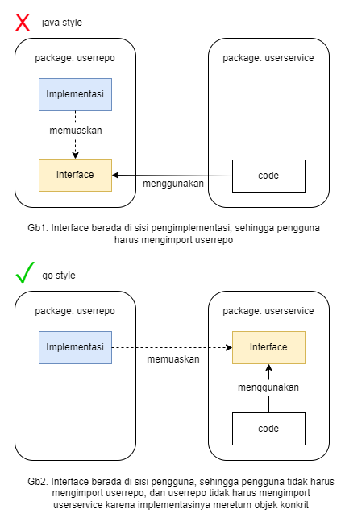

# Golang Repository Template dengan Arsitektur Hexagonal

Template ini menyediakan struktur monorepo dengan arsitektur hexagonal untuk pengembangan aplikasi Golang. Fokus utamanya adalah pada pemisahan logika inti dari ketergantungan eksternal, serta mendukung pemakaian ulang kode di berbagai mode aplikasi.

Seringkali, program yang kita buat tidak hanya berupa server HTTP, tetapi juga mencakup event consumer, CLI, migrasi database dengan logika, atau kombinasi dari semuanya. Oleh karena itu, template ini sangat cocok untuk kebutuhan tersebut.

## Prinsip-prinsip yang mendasari desain ini :

1. Arsitektur Hexagonal: Memisahkan logika inti dari ketergantungan eksternal untuk menjaga kebersihan kode dan memudahkan pengujian.
2. Pengelolaan Dependensi: Menghindari error siklus dependensi dengan menerapkan prinsip dependency inversion, sehingga modul-modul dapat saling berinteraksi tanpa saling bergantung secara langsung.
3. Kejelasan Struktur Kode: Menggunakan folder `pkg/` untuk kode yang dapat digunakan ulang di berbagai bagian aplikasi dan folder `business/` untuk menyimpan logika bisnis dan domain khusus.
4. Aturan Pengembangan Aplikasi: Menetapkan aturan untuk pengelolaan konfigurasi, penanganan kesalahan, dan penamaan untuk memastikan konsistensi dan kualitas kode.
5. Alat Bantu: Memanfaatkan Makefile untuk mempercepat proses pengembangan dan pre-commit hooks untuk menjaga kualitas kode dan mencegah kesalahan sebelum kode di-commit.

## Tujuan :  

- Konsistensi Pengembangan: Menyediakan metode yang seragam dalam membangun aplikasi untuk meningkatkan pemahaman dan kolaborasi tim.
- Modularitas: Memastikan kode terpisah antar modul dan tidak tightly coupled, sehingga memudahkan pemeliharaan dan pengembangan lebih lanjut.
- Arsitektur yang Bersih: Mengikuti prinsip arsitektur hexagonal untuk memisahkan logika inti dari ketergantungan eksternal, meningkatkan fleksibilitas dan kemudahan pengujian.
- Manajemen Dependensi yang Efektif: Menghindari error siklus dependensi meskipun ada banyak modul yang saling terhubung, melalui penerapan prinsip dependency inversion.
- Kode yang Testable: Memastikan bahwa kode di lapisan logika dapat diuji dengan baik, meningkatkan kualitas dan keandalan aplikasi.

Arsitektur heksagonal berfokus pada pemisahan core logika dari ketergantungan eksternal. Core harus bersih, hanya terdiri dari pustaka standar dan kode pembungkus yang dibangun dalam repositori ini.

Istilah `core` dapat diganti dengan `service` atau `usecase`, sedangkan `port` dengan `storer`. Pada dasarnya, port adalah sebuah inteface.

## Content

- [Quick start](#quick-start)
- [Project structure](#project-structure)
- [Aturan Teknis](#aturan-teknis)

## Quick start

Local development:  

```sh

# 1. pastikan ketersediaan dependency seperti database dll.
# 2. menjalankan aplikasi dengan makefile (lihat file Makefile)
$ make run/api/user

# command tersebut akan mengeksekusi
$ go run ./app/api-user

```  

## Project structure

```bash
├── app
│   ├── api-user
│   │   ├── handler
│   │   │   ├── health_check.go
│   │   │   └── user.go
│   │   ├── main.go
│   │   └── url_map.go
│   ├── consumer-user
│   │   └── main.go
│   └── tool-logfmt
│       └── main.go
├── business
│   ├── complex
│   │   ├── helper
│   │   │   └── formula.go
│   │   ├── ports
│   │   │   └── storer.go
│   │   ├── repo
│   │   │   └── repo.go
│   │   └── service
│   │       └── service.go
│   ├── notifserv
│   │   └── service.go
│   └── user
│       ├── repo.go
│       ├── service.go
│       └── storer.go
├── conf
│   ├── conf.go
│   └── confs.go
├── go.mod
├── go.sum
├── migrations
│   ├── 000001_create_user.down.sql
│   └── 000001_create_user.up.sql
├── models
│   ├── notif
│   │   └── notif.go
│   └── user
│       ├── user_dto.go
│       └── user_entity.go
└── pkg
    ├── db-pg
    │   └── db.go
    ├── errr
    │   └── custom_err.go
    ├── mid
    │   └── middleware.go
    ├── mlog
    │   ├── log.go
    │   └── logger.go
    └── validate
        └── validate.go
```

### `app/`

Menyimpan kode yang tidak dapat digunakan ulang. Titik awal program ketika dijalankan :
- Memulai dan menghentikan aplikasi.
- Spesifik untuk operasi input/output. 

Pada kebanyakan projek lainnya, folder ini akan dinamakan dengan `cmd`. Dinamakan app karena posisi folder akan berada diatas (yang mana dirasa cukup bagus) dan cukup mewakili fungsi folder.  

Alih-alih menggunakan kerangka kerja seperti Cobra untuk memilih aplikasi yang dijalankan, kita menggunakan metode paling sederhana seperti menjalankan program dengan `go run ./app/api-user` untuk aplikasi API-USER dan `go run ./app/consumer-user` untuk aplikasi KAFKA-USER-CONSUMER.


### `pkg/`

Berisi paket-paket yang dapat digunakan ulang di mana saja, biasanya elemen dasar yang tidak terkait dengan modul bisnis, seperti logger, web framework, dan helper umum. Tempat untuk meletakkan library yang sudah di wrap agar mudah di mock. 
Lapisan aplikasi dan lapisan bisnis dapat mengimpor `pkg`.

Menggunakan `pkg/` sebagai penampung kode yang awalnya tidak jelas tempatnya terbukti mempercepat penulisan kode. Pertanyaan seperti `"Taruh di mana?"` akan mendapatkan jawaban `"Taruh di pkg."` secara default.


### `business`

Berisi code yang terkait dengan logika bisnis, problem bisnis, data bisnis.

#### `business/{nama-domain}/*`

Dalam setiap domain bisnis, ada layer service (atau core dalam istilah hexagonal) yang harus tetap bersih dari pustaka eksternal. Ini mencakup lapisan untuk mengakses data persisten (repo) dan interface-interface yang berfungsi sebagai port.

#### `business/{nama-domain}/{subfolder}`

Terkadang, sebuah domain dapat menjadi sangat kompleks, sehingga perlu memisahkan service, repo, dan elemen lainnya ke dalam beberapa bagian. Dalam kasus seperti ini, kita lebih memilih untuk mengatur dan memisahkan komponen-komponen tersebut ke dalam folder yang berbeda, yang juga akan memerlukan penggunaan package yang berbeda. Misalnya, business/complex.

### `models`

Model-model (termasuk DTO, Payload, Entitas) dapat diletakkan di dalam package bisnis masing-masing. Namun, dalam kasus yang kompleks, di mana aplikasi A membutuhkan model B dan C, kita bisa mempertimbangkan untuk menempatkan model-model tersebut di level yang lebih tinggi agar dapat diakses oleh semuanya.

## Rules

Sangat penting untuk membuat dan memperbarui aturan yang telah disepakati agar semua pihak mengikuti pendekatan yang konsisten. Misalnya, template repositori ini didasarkan pada kemampuannya untuk menghindari kode yang terlalu terikat (tightly-coupled), maka aturan `Cara Penulisan Dependensi Kode` menjadi sangat penting untuk dipatuhi. 

Aturan ini akan bertambah seiring berjalannya waktu. Misalnya, yang seringkali terjadi perbedaan pendapat : 
- `Bagaimana cara melakukan database transaction di logic layer ?`
- `Seberapa dalam kondisi if else boleh dilakukan`. dsb. 

### Cara Penulisan Dependensi Kode

#### Menggunakan Dependency Injection :
Dependency Injection (DI) adalah pola desain di mana dependensi disediakan dari luar objek tersebut. Ini membantu mengelola ketergantungan antar komponen, membuat kode lebih modular, dan memudahkan pengujian. Jadi, modul yang saling ketergantungan, harus bergantung pada abstraksi.

Contoh konstruktor untuk membuat logic service user  `business/user/service.go`

```go
type UserService struct {
	storer   UserStorer
	notifier NotifSender
}

// NewUserService memerlukan UserStorer dan NotifSender.
// UserStorer dan NotifSender adalah abstraksi yang diperlukan oleh UserService
// Objek yang akan memenuhi UserStorer dan NotifSender ini akan ditentukan oleh 
// pengaturan dependensi di folder /app.
// UserStorer dan NotifSender juga dapat dibuat tiruannya untuk memudahkan pengujian
func NewUserService(store UserStorer, notifier NotifSender) *UserService {
	return &UserService{storer: store, notifier: notifier}
}
```

#### Menerapkan Prinsip Dependency Inversion: 
Di lapisan business, terutama untuk bagian logic (biasanya dinamakan `service.go` atau `usecase.go` atau `core`), komunikasi antar layer mengandalkan abstraksi dan penerapan prinsip `dependency inversion` yang kuat. Dalam golang, dependensi inversi yang sesungguhnya bisa dicapai seperti penjelasan pada gambar berikut.  

  

Mengenai posisi interface, sebaiknya diletakkan pada modul yang membutuhkannya. Hal ini pernah dibahas dalam buku [100 Go Mistake and how to avoid them](https://www.manning.com/books/100-go-mistakes-and-how-to-avoid-them) dan beberapa buku lainnya.

Misalnya, domain `business/user` terhubung dengan `business/notifserv`. Implementasi dependensinya dapat dilihat di app/api-user/routing.go. Metode ini mencegah error siklus dependensi impor dan memastikan kode tetap tidak terlalu terikat (tightly-coupled) antar domain.

Contoh dependensi yang dibutuhkan untuk membuat core logic user `business/user/storer.go`: 
```go
package user

import (
	"context"
	modelUser "templaterepo/models/user"
)

// UserStorer adalah interface yang mendefinisikan operasi yang dapat dilakukan terhadap database user.
// Interface ini Merupakan milik dari layer service dan dimaksudkan ditulis pada bagian layer service
// Meskipun kita tau persis implementasinya ada di business/user/repo.go, tetap layer service (core) hanya bergantung pada interface ini.
// Implementasi konkret dari antarmuka ini akan ditentukan oleh pengaturan dependensi di folder /app.
type UserStorer interface {
	Get(ctx context.Context, uid string) (modelUser.UserDTO, error)
	CreateOne(ctx context.Context, user *modelUser.UserEntity) error
}

// NotifSender adalah interface yang mendefinisikan operasi untuk mengirim notifikasi.
// Interface ini Merupakan milik dari layer service dan dimaksudkan ditulis pada bagian layer service
// Objek yang digunakan untuk mengirim notifikasi akan ditentukan oleh pengaturan dependensi di folder /app.
type NotifSender interface {
	SendNotification(message string) error
}
```

Contoh konstruktor untuk membuat notif `business/notifserv/service.go`
```go
package notifserv

type NotifService struct{}

// return konkrit struct, bukan interfacenya
// karena NotifService tidak dikekang hanya untuk menjadi NotifSender
func NewNotifServ() *NotifService { 
	return &NotifService{}
}

// SendNotification diperlukan untuk memenuhi interface NotifSender pada service user
func (n *NotifService) SendNotification(message string) error {
	// TODO : send notif to other server
	return nil
}

// SendWhatsapp tidak diperlukan oleh service user namun bisa jadi diperlukan oleh service lain
func (n *NotifService) SendWhatsapp(message string, phone string) error {
	// TODO : send whatsapp 
	return nil
}
```

### Aturan Lainnya yang Disepakati

- Ikuti panduan gaya Uber sebagai dasar ([https://github.com/uber-go/guide/blob/master/style.md](https://github.com/uber-go/guide/blob/master/style.md)). Aturan ini akan ditimpa apabila ada aturan yang tertulis disini.
- File konfigurasi hanya boleh diakses di main.go. Lapisan lain yang ingin mengakses konfigurasi harus menerimanya melalui parameter fungsi.
- Konfigurasi harus memiliki nilai default yang berfungsi di environment lokal, yang dapat ditimpa oleh file `.env` dan argumen pada command line.
- Error harus dihandle hanya sekali dan tidak boleh di abaikan. Maksudnya adalah antara di konsumsi atau di return, tetapi tidak keduanya sekaligus. contoh konsumsi : menulis error pada log, contoh return : mereturn error apabila error tidak nil.
- Jangan mengekspose variable dalam package, Gunakan kombinasi variabel private dan fungsi publik sebagai gantinya.
- Ketika kode banyak digunakan, buatlah helper.go. Namun jika digunakan di beberapa paket, buatlah paket baru (misalnya untuk mengekstrak error yang cuma ada di user, `/business/user/ipkg/error_parser.go`). Jika penggunaannya sangat luas, masukkan di `/pkg` (misalnya, `pkg/slicer/slicer.go`, `pkg/datastructure/ds.go`, `pkg/errr/custom_error.go`).
- Patuhi idiom golang. Namakan interface dengan akhiran -er atau -tor untuk menunjukkan bahwa mereka adalah interface, misalnya Writer, Reader, Assumer, Saver, Reader, Generator. ([https://go.dev/doc/effective_go#interface-names](https://go.dev/doc/effective_go#interface-names)). Contoh: Dalam proyek dengan tiga lapisan: UserServiceAssumer, UserStorer, UserSaver, UserLoader.


## Tools

### `Makefile`

Makefile berisi command untuk membantu proses menjalankan aplikasi dengan cepat karena tidak harus mengingat semua command yang panjang. Berfungsi seperti alias. Caranya adalah dengan menuliskan cmd di file Makefile seperti contoh berikut.

Baris teratas adalah comment yang akan muncul ketika memanggil helper.  
`.PHONY` adalah penanda agar terminal tidak menganggap command makefile sebagai akses ke file.  
`run/tidy:` adalah alias untuk cmd yang ada didalam nya.

```sh
## run/tidy: run golang formater and tidying code
.PHONY: run/tidy
run/tidy:
  @echo 'Tidying and verifying module dependencies...'
  go mod tidy
  go mod verify
  @echo 'Formatting code...'
  go fmt ./...
```

### `pre-commit`

Disarankan menggunakan pre-commit (doc : [pre-commit]("https://pre-commit.com/")).  

  ```bash
  // init
  pre-commit install

  // precommit akan di trigger setiap commit

  // manual
  pre-commit run --all-files

  ```
